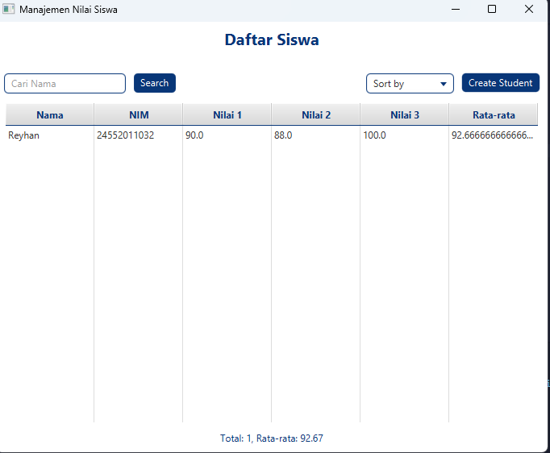

# Aplikasi Manajemen Nilai Siswa (JavaFX)

Aplikasi desktop sederhana berbasis JavaFX untuk mengelola data dan nilai akhir siswa. Dibuat sebagai studi kasus untuk implementasi konsep OOP, GUI, file handling, sorting, searching, dan rekursi.

## 🎯 Fitur Utama

- ✅ Membaca data siswa dari file CSV (`siswa.csv`)
- ✅ Menampilkan data siswa ke dalam tabel (TableView)
- ✅ Menambahkan data siswa baru melalui dialog interaktif
- ✅ Mengurutkan data siswa berdasarkan nama atau nilai akhir (ASC/DESC)
- ✅ Mencari siswa berdasarkan nama menggunakan binary search
- ✅ Menghitung total dan rata-rata nilai akhir menggunakan rekursi
- ✅ Validasi input dan feedback kesalahan secara interaktif
- ✅ GUI interaktif menggunakan FXML + JavaFX

## 🛠️ Teknologi

- Java 11 atau lebih tinggi
- JavaFX 17+
- Scene Builder (untuk editing FXML jika diperlukan)
- IDE seperti IntelliJ IDEA / Eclipse

## 🚀 Cara Menjalankan

1. Clone repositori ini:

   git clone https://github.com/Xyzting/mengelola-nilai-siswa.git
   cd nilai-siswa-javafx

2. Buka dengan IDE yang support JavaFX (seperti IntelliJ IDEA atau Eclipse)

3. Jalankan Main.java sebagai Java Application

   > Pastikan sudah mengatur JavaFX SDK di project structure atau module settings.

4. File siswa.csv akan otomatis dibuat jika belum ada. Kamu bisa isi datanya secara manual atau lewat fitur tambah data di aplikasi.

## 📄 Format File CSV

NIM,Nama,Nilai1,Nilai2,Nilai3  
12345,Andi,80,85,90  
67890,Budi,75,70,80

## 📷 Tampilan GUI

---
